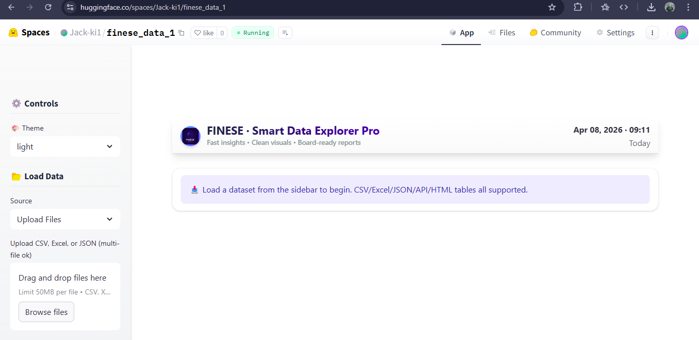
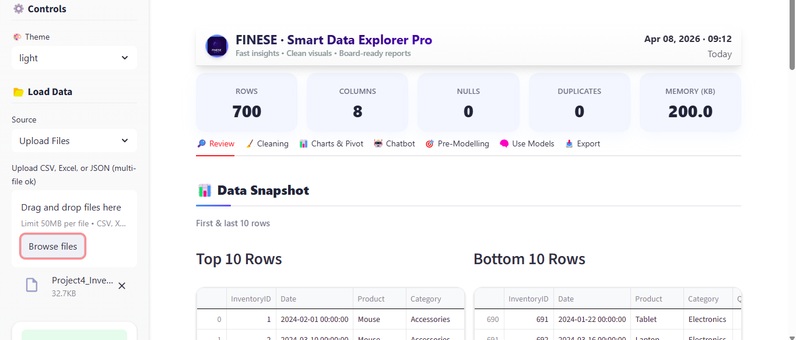
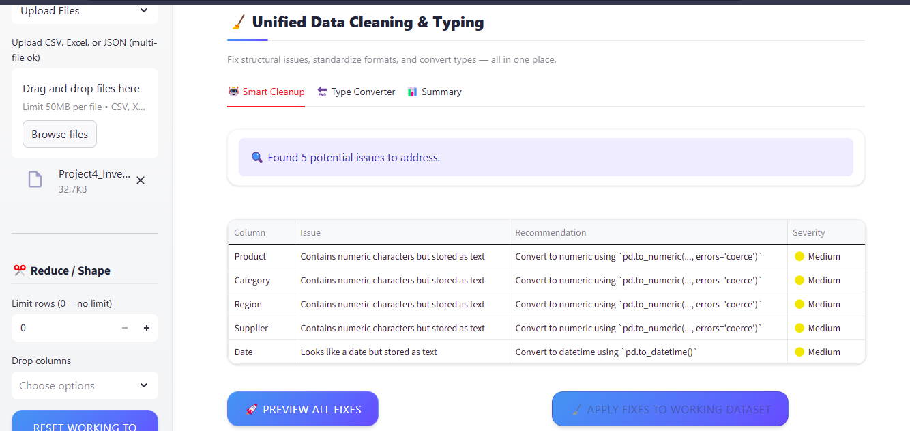

# FINESE ONE

== ACCESS LINK: https://huggingface.co/spaces/Jack-ki1/finese_data_1

A comprehensive, modular data analysis platform with AI-powered insights, automated cleaning, modeling, and export capabilities.

## 📊 Overview

FINESE is a powerful data intelligence platform that transforms raw datasets into actionable insights without writing code. Whether you're a data analyst, scientist, or business decision-maker, FINESE provides a seamless workflow for exploring, cleaning, analyzing, and presenting data.

The application features an intuitive interface with multiple tabs for different data analysis tasks, as shown in the screenshots below:


*Figure 1: Data loading interface with upload options*


*Figure 2: Data review dashboard showing dataset statistics and snapshot*


*Figure 3: Unified data cleaning and typing recommendations*


## ✨ Key Features

### 🔍 **Intelligent Data Review**
- Automatic data profiling and quality assessment
- Visual data summaries with key metrics
- Missing value and duplicate detection
- Interactive data exploration

### 🧹 **Smart Data Cleaning**
- Automated type detection and conversion suggestions
- Bulk apply cleaning transformations
- Side-by-side preview of changes
- Reversible cleaning operations

### 📊 **Interactive Charts & Visualizations**
- Drag-and-drop chart builder
- Multiple visualization types (bar, line, scatter, histograms, heatmaps)
- Dynamic filtering and drill-down capabilities
- Export charts in multiple formats

### 💬 **AI-Powered Chatbot**
- Natural language queries about your data
- Supports OpenAI, Anthropic, and Google Gemini APIs
- Rule-based engine for offline use
- Automated insight generation

### 🧠 **Machine Learning Studio**
- Automated feature engineering
- Model selection and comparison
- Hyperparameter optimization
- Model interpretability and SHAP explanations
- Export models and code

### 📤 **Comprehensive Export Options**
- Export cleaned data in multiple formats (CSV, Excel, JSON)
- Professional PDF and PowerPoint reports
- Model export (joblib, pickle)
- Production-ready Python code generation

### 🗣️ **New: SQL Query Interface**
- Query your data using standard SQL syntax
- Schema explorer for easy column discovery
- Download query results as CSV
- Powered by DuckDB for fast analytics

## 🛠️ Tech Stack

- **Frontend**: Streamlit
- **Data Processing**: Pandas, NumPy
- **Visualization**: Plotly, Matplotlib, Seaborn
- **ML**: Scikit-learn, XGBoost, LightGBM, CatBoost
- **Reports**: ReportLab, Python-PPTX
- **AI**: OpenAI, Anthropic, Google Gemini APIs
- **SQL**: DuckDB

## 🚀 Getting Started

### Prerequisites

- Python 3.10+
- pip package manager

### Installation

1. Clone the repository:
   ```bash
   git clone https://github.com/your-username/FINESE.git
   cd FINESE
   ```

2. Install dependencies:
   ```bash
   pip install -r requirements.txt
   ```

3. Run the application:
   ```bash
   streamlit run app.py
   ```

### Environment Variables (Optional)

To use AI features, set your API keys:

```bash
export OPENAI_API_KEY="your-openai-key"
export ANTHROPIC_API_KEY="your-anthropic-key"
export GOOGLE_GEMINI_API_KEY="your-google-key"
```

## 📁 Project Structure

```
FINESE/
├── app.py                 # Main application entry point
├── config.py              # Application configuration
├── theme.py               # Theme and styling
├── utils/                 # Utility modules
│   ├── data_utils.py      # Data processing utilities
│   ├── ml_utils.py        # ML-specific utilities
│   ├── ui_utils.py        # UI utilities
│   ├── health_utils.py    # Data health utilities
│   └── __init__.py        # Backward compatibility
├── tabs/                  # Application tabs
│   ├── review.py          # Data review tab
│   ├── cleaning.py        # Data cleaning tab
│   ├── charts.py          # Charts and visualization tab
│   ├── chatbot.py         # AI chatbot tab
│   ├── export.py          # Export functionality tab
│   ├── make_a_model.py    # ML modeling tab
│   ├── review.py          # Data review tab
│   └── sql_query.py       # SQL query interface
├── state.py               # State management
├── data_store.py          # Data storage layer
├── access_layer.py        # Data access layer
├── requirements.txt       # Dependencies
├── Dockerfile             # Container configuration           
└── README.md             #  Documentation
```

## 🏗️ Architecture Improvements

The project has undergone significant architectural improvements to address scalability and maintainability:

### 1. **State Management**
- Centralized state management in `state.py`
- Session state initialization with defaults
- Proper invalidation of cached data

### 2. **Data Access Layer**
- Isolated data operations in `data_store.py`
- Safe access patterns preventing direct manipulation
- Cache invalidation strategies

### 3. **Modular Utilities**
- Split `utils.py` into domain-specific modules:
  - `data_utils.py`: Data processing functions
  - `ml_utils.py`: ML-specific utilities
  - `ui_utils.py`: UI-related helpers
  - `health_utils.py`: Data health calculations

### 4. **Bug Fixes**
- Fixed unreachable code in chatbot's `_parse_natural_language` function
- Removed duplicate function definition in `make_a_model.py`
- Corrected f-string syntax for Python 3.10 compatibility
- Improved data filtering to prevent silent sampling issues
- Enhanced performance of type detection functions
- Fixed consistency score calculation to prevent negative values

### 5. **Performance Enhancements**
- Optimized caching mechanisms
- Vectorized operations for type detection
- Efficient data filtering without unnecessary recomputation
- Memory management for large datasets

### 6. **New Features**
- SQL query interface using DuckDB
- Comprehensive experiment tracking
- Automated feature engineering
- Advanced EDA capabilities
- Time series analysis
- Missingness pattern analysis

## 🤖 Using the AI Chatbot

The AI chatbot can answer questions about your data using natural language. You can ask questions like:

- "What are the top 5 categories by total sales?"
- "Which columns have more than 20% missing values?"
- "Show me a bar chart of average price by region"
- "Is there a correlation between age and income?"

The chatbot supports both online AI services (when API keys are provided) and a rule-based engine for offline use.

## 📈 Machine Learning Studio

The ML Studio provides a complete workflow for building machine learning models:

1. **Problem Type Selection**: Choose between classification and regression
2. **Feature Selection**: Select input features and target variable
3. **Feature Engineering**: Apply transformations and scaling
4. **Model Selection**: Compare multiple algorithms with cross-validation
5. **Model Training**: Train and evaluate models
6. **Model Interpretation**: Understand feature importance and model decisions
7. **Model Export**: Export trained models and production code

## 📊 Export Capabilities

Export your analysis and models in various formats:

- **Data**: CSV, Excel, JSON
- **Visualizations**: PNG, SVG, HTML
- **Reports**: PDF, PowerPoint, Markdown
- **Models**: Joblib, Pickle
- **Code**: Production-ready Python scripts

## 🐳 Docker Deployment

The application can be deployed using Docker:

```bash
# Build the image
docker build -t finese .

# Run the container
docker run -p 8501:8501 finese
```

## 🤝 Contributing

We welcome contributions to the FINESE project! Here's how you can contribute:

1. Fork the repository
2. Create a feature branch (`git checkout -b feature/amazing-feature`)
3. Commit your changes (`git commit -m 'Add some amazing feature'`)
4. Push to the branch (`git push origin feature/amazing-feature`)
5. Open a Pull Request


---

Made with ❤️ by the FINESE Team

Transform your data into insights with FINESE!
